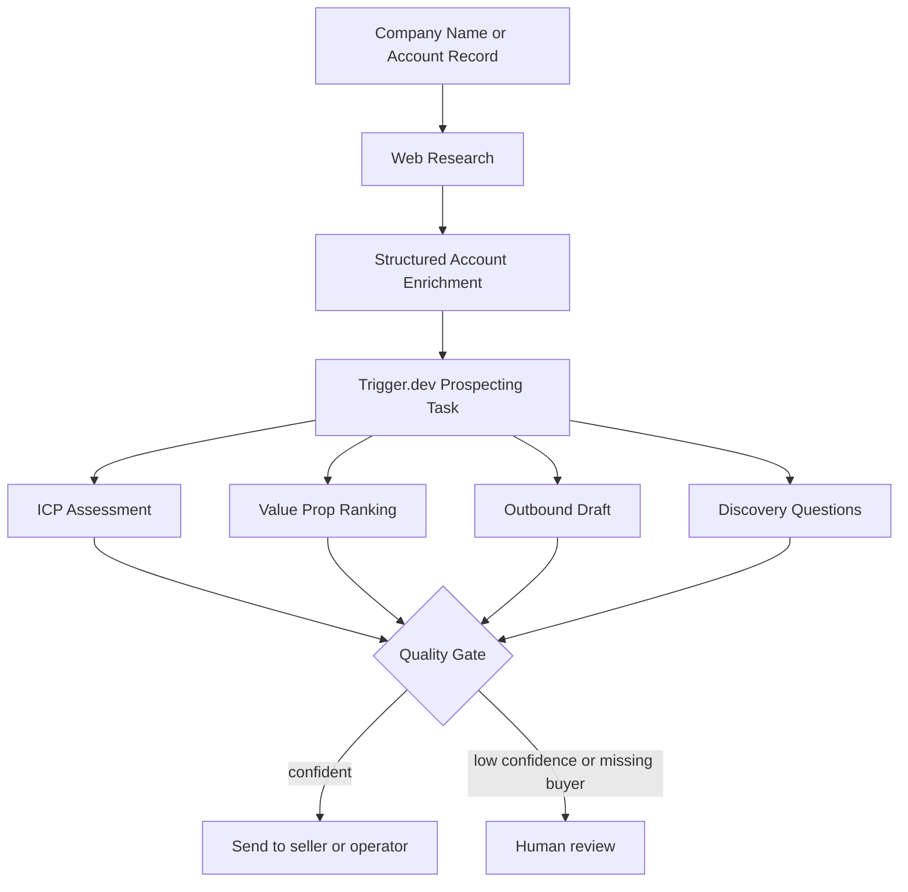

# Pipeline Prospecting Agent

Configurable AI account research and outbound drafting for GTM teams.

This project takes a company record or company name, enriches it with public web research, scores ICP fit, recommends the best value propositions, drafts a first-touch email, and produces discovery questions plus quality flags. It is built as an opinionated reference implementation for GTM engineers who want structured AI outputs, explicit safety gates, and task-based orchestration.

## What it does

- Enriches company data from public web results
- Structures account context into a typed schema
- Produces a `ProspectingOutput` object with:
  - ICP fit
  - value proposition ranking
  - outbound draft
  - discovery questions
  - confidence score
  - human-review flags
- Evaluates output quality with deterministic checks
- Supports both Trigger.dev task execution and a local Next.js playground

## Architecture



## Project Structure

```text
.
├── data/accounts.json          # Sample account fixtures
├── src/
│   ├── config.ts               # Product context, ICP rules, prompt
│   ├── prospecting.ts          # Claude call + deterministic post-processing
│   ├── schemas.ts              # Zod schemas
│   └── trigger/
│       ├── prospect-account.ts
│       └── prospect-all.ts
└── web/
    ├── app/                    # Local Next.js playground
    ├── components/
    ├── data/showcase.json      # Fictional sample analyses
    └── lib/
```

## Setup

### 1. Install dependencies

```bash
npm install
cd web && npm install
```

### 2. Configure environment

```bash
cp .env.example .env
cp web/.env.example web/.env.local
```

Required variables:

```bash
ANTHROPIC_API_KEY=
TAVILY_API_KEY=
```

Optional safety variable:

```bash
DEMO_ACCESS_TOKEN=
```

If `DEMO_ACCESS_TOKEN` is unset, the playground API only works from localhost. If you set it for a hosted deployment, callers must provide it in the `x-demo-token` header. The web UI also supports `?token=...` for private demo links.

If you want to use the local playground against Trigger.dev, also set the Trigger.dev environment variables documented in their dashboard.

## Local development

### Trigger.dev tasks

```bash
npm run dev
```

### Playground

```bash
cd web
npm run dev
```

The playground is local-only by default. This repo does not assume a hosted public demo.

## Example input

```json
{
  "id": 1,
  "company": "Northstar Field Services",
  "industry": "Facilities services",
  "us_employees": 4800,
  "contact_name": "Alicia Gomez",
  "contact_title": "VP, Revenue Operations",
  "crm_platform": "Salesforce",
  "notes": "Multi-region field team with branch-level quoting and an expanding enterprise sales motion"
}
```

## Example output shape

```json
{
  "account_id": 1,
  "company": "Northstar Field Services",
  "icp_fit": "strong_fit",
  "matched_value_props": [
    {
      "value_prop": "pipeline_visibility",
      "relevance_score": 0.91,
      "reasoning": "..."
    }
  ],
  "email_framework": "pain_led",
  "email_subject": "Branch-level pipeline visibility at Northstar",
  "email_body": "...",
  "discovery_questions": [
    {
      "question": "...",
      "rationale": "..."
    }
  ],
  "confidence_score": 0.87,
  "flags": [],
  "market_intelligence": "...",
  "sparse_data_handling": "..."
}
```

## Customization

This repo is intentionally opinionated, but the business logic is meant to be swapped:

- Edit [`src/config.ts`](src/config.ts) to change:
  - product profile
  - ICP definition
  - value props
  - prompt instructions
- Edit [`data/accounts.json`](data/accounts.json) for your own fixtures
- Edit [`web/lib/enrichment.ts`](web/lib/enrichment.ts) if you want different search heuristics or contact roles
- Replace the local playground entirely if your real entrypoint is a CRM event, queue consumer, or internal tool

## Design decisions

- Structured outputs over freeform parsing
- Deterministic post-processing for email suppression and quality checks
- Separate ICP fit from data completeness
- Research signals inform strategy, but unverified details should not appear in outbound copy

## Scripts

```bash
npm run dev
npm run deploy
npm run test
npm run typecheck

cd web && npm run dev
cd web && npm run build
cd web && npm run test
cd web && npm run typecheck
```

## Limitations

- Web research is noisy and can misattribute data without careful prompt constraints
- This repo does not include CRM write-back or approval workflows
- The default configuration represents one GTM use case, not a universal prospecting rubric
- If you deploy the playground publicly, add stronger authentication and rate limiting than the lightweight demo token used here

## License

MIT
